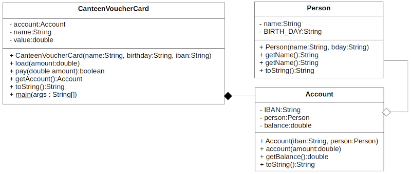

Topic: using objects

## Learning Task: The canteen voucher card

Design and implement a CanteenVoucherCard-class that provides the following features:  
The canteen voucher card should use a bank account to get loaded with money by the user. The card can be used for canteen payments as long as it has enough value. If it has not enough value the user should load more money with help of the bank account.  

So this class should have the following attributes:  
- name of the card user,  
- the related bank account ([Account](Account.java)),  
- current value of the voucher

The related bank account object should be created inside the construtor of the CanteenVoucherCard.

Design the propper UML class diagram of the CanteenVoucherCard-class. Discuss your class diagram with another student.

Afterwards implement the Java class of the CanteenVoucherCard and test your implementation based on the main-method given here.


``` java
package org.htwd.pool.o3; 

public class CanteenVoucherCard {

   
    public static void main(String[] args) {
        CanteenVoucherCard card = new CanteenVoucherCard("Lis", "21/12/2002", "DE7891234455667");
        Account acc = card.getAccount();
        acc.account(100.0);

        card.load(10.0);
        System.out.println(card);
        card.pay(2.97);
        System.out.println(card);
    }
}
``` 

---------------------------------------

### Solution

The UML-class-diagram to show the design of the CanteenVoucherCard-class:


The related implementation of the Java CanteenVoucherCard-class:

``` java
package org.htwd.pool.o3; 

public class CanteenVoucherCard {

    private String name;
    private Account account;
    private double value;

    public CanteenVoucherCard(String name, String birthday, String iban) {
        this.account = new Account(iban, new Person(name, birthday));
        this.name = name;
        this.value = 0.0;
        this.load(20.0);
    }

    public void load(double amount) {
        account.account(-1.0*amount);
        this.value += amount;
    }

    public boolean pay(double amount) {
        if (amount < this.value) {
            this.value -= amount;
            return true;
        }
        return false;
    }

    public Account getAccount() { return this.account; }

    public String toString() {
        StringBuilder sb = new StringBuilder(this.name);
        sb.append(" : value EUR:");
        sb.append(this.value);
        sb.append(" : Account:");
        sb.append(this.account);
        return sb.toString();
    }

    public static void main(String[] args) {
        CanteenVoucherCard card = new CanteenVoucherCard("Lis", "21/12/2002", "DE7891234455667");
        Account acc = card.getAccount();
        acc.account(100.0);
        card.load(10.0);
        System.out.println(card);
        card.pay(2.97);
        System.out.println(card);
    }
}
``` 

| **Learning objective**                           | **Task type**   | **Complexity** |
| ------------------------------------------------ | --------------- | -------------- |
| understand concepts of using objects             | conventional task  | 2 - normal  |  

#### Previous Knowledge

bcm-1: basics of classes, public/private modifieres  
uob-1: basics of creating and using objects  
uml-2: basics of UML class diagrams including class composition and aggregation

#### Learning Activities

1) read the task and understand the requirements
2) design the UML class diagram of the new class
3) read the given main-method of the new class and double-check with the class methods designed in the UML class diagram
4) implement the Java code of the CanteenVoucherCard class
5) run the program to test it

#### Supporting information

[Java-OOP-Poster](../JavaPosterOOP_engl.pdf): Box 5

[tutorialspoint.com: Java - Classes and objects](https://www.tutorialspoint.com/java/java_object_classes.htm)  
[tutorialspoint.com: Java - Aggregation](https://www.tutorialspoint.com/java/java_aggregation.htm)  
[tutorialspoint.com: Java - Composition](https://www.tutorialspoint.com/association-composition-and-aggregation-in-java)  

ToDo: Matthes, E. (2019). Python crash course a hands-on, project-based introduction to programming (2nd edition). No Starch Press.:  
Chapter 2, pages 15-32, Chapter 7, pages 114-116  

---------------------------------------
Author: Robert Ringel, Faculty Informatics/Mathematics, HTWD – University of Applied Sciences  
Version: 10/2025            
License: CC BY-SA 4.0
