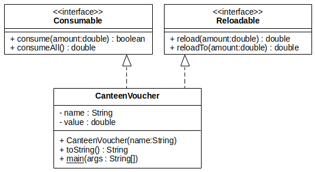

Topic: extension, interface

## Learning Task: The Canteen Voucher UML class diagram

The code below shows three Java classes. Read the code to obtain an understanding.  
Draw the according UML class diagram. 

**The interface class Consumable:**
``` java
package org.htwd.pool.o2;

public interface Consumable {
    public boolean consume(double amount);
    public double consumeAll();
}
```

**The interface class Reloadable:**
``` java
package org.htwd.pool.o2;

public interface Reloadable {
    public double reload(double amount);
    public double reloadTo(double value);
}
```

**The CanteenVoucher class:**
``` java
package org.htwd.pool.o2;

public class CanteenVoucher implements Reloadable, Consumable {

    private double value;
    private String name;

    public CanteenVoucher(String name) {
        this.name = name;
        this.value = 0.0;
    }

    public double reload(double amount) {
        if (amount < 0)
            return 0.0;
        this.value += amount;
        return amount;
    }

    public double reloadTo(double value) {
        if (value < this.value)
            return 0.0;
        double amount = value - this.value;
        this.value = value;
        return amount;
    }

    public boolean consume(double amount) {
        if (this.value >= amount && amount > 0) {
            this.value -= amount;
            return true;
        }
        return false;
    }

    public double consumeAll() {
        double v = this.value;
        this.value = 0.0;
        return v;
    }

    public String toString() {
        StringBuilder sb = new StringBuilder(this.name);
        sb.append(" : value EUR:");
        sb.append(this.value);
        return sb.toString();
    }

    public static void main(String args[]) {
        CanteenVoucher c = new CanteenVoucher("Bob");
        c.reload(20.0);
        c.consume(5.00);
        double v = c.reloadTo(25.0);
        System.out.println(v);
        System.out.println(c);
        v = c.consumeAll();
        System.out.println(v);
    }
}
```

---------------------------------------

### Solution

 


| **Learning objective**                           | **Task type**   | **Complexity** |
| ------------------------------------------------ | --------------- | -------------- |
| relate Java source code to an UML class diagram  | conventional task | 2 - normal   |

#### Previous Knowledge

bcm-1: basics of classes, public/private/final modifieres  
exi-2: basics of class interfaces  
uml-2: basics of UML class diagrams including interface classes

#### Learning Activities

1) read the given Java code
2) draw the UML class diagram

#### Supporting information

[Java-OOP-Poster](../JavaPosterOOP_engl.pdf): Boxes 1-4

[tutorialspoint.com: UML - Basic Notations: Class Notation](https://www.tutorialspoint.com/uml/uml_basic_notations.htm)  
[tutorialspoint.com: UML - Class Diagram](https://www.tutorialspoint.com/uml/uml_class_diagram.htm)

---------------------------------------
Author: Robert Ringel, Faculty Informatics/Mathematics, HTWD – University of Applied Sciences  
Version: 10/2025            
License: CC BY-SA 4.0
