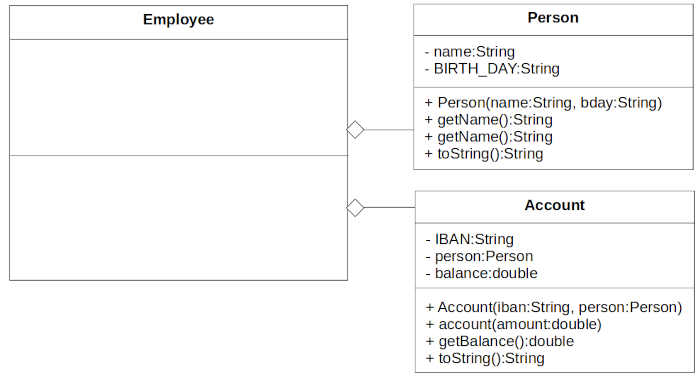
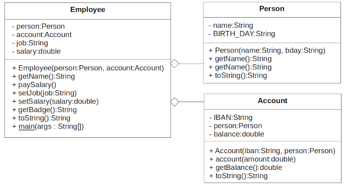

Topic: using objects

## Learning Task: The Employee class 

You should design an Employee class. The employee should be a aggregation of the Person and the Account classes. The Java code of the classes [Person](Person.java) and [Account](Account.java) is avaiable by clicking on the links.  



Design the Employee class with help of the given UML class diagram below. First fill in the class diagram. Afterwards implement this class as Java code and test the implementation with a basic main-method.  

**Help:** The solution of this task can be seen as an imitation of the [NoCreditCardWithoutAccount-Task](NoCreditCardWithoutAccount.md).

---------------------------------------

### Solution

A potential solution for the design of the Emplyee-class is shown in the below UML class diagram. The related Java code for this sample solution is shown here as well.



``` java
package org.htwd.pool.o3; 

public class Employee {
    private Person person;
    private Account account;
    private String job;
    private double salary;

    public Employee(Person person, Account account) {
        this.person = person;
        this.account = account;
        this.job = "undef";
        this.salary = 0.0;
    }

    public String getName() { return this.person.getName(); }
    public void paySalary() { this.account.account(this.salary); }
    public void setJob(String job) { this.job = job; }
    public void setSalary(double salary) { this.salary = salary; }

    public String getBadge() {
        StringBuilder sb = new StringBuilder(this.getName());
        sb.append("\n");
        sb.append(this.job);
        return sb.toString();
    }

    public String toString() {
        StringBuilder sb = new StringBuilder(this.person.toString());
        sb.append(" : ");
        sb.append(this.job);
        sb.append(" : salary EUR:");
        sb.append(this.salary);
        sb.append(" : account:");
        sb.append(this.account);
        return sb.toString();
    }

    public static void main(String[] args) {
        Person bob = new Person("Bob", "27/12/2002");
        Account acc_bob = new Account("DE123454322134", bob);
        Employee eBob = new Employee(bob, acc_bob);
        eBob.setJob("Manager");
        eBob.setSalary(5000.0);
        System.out.println(eBob.getBadge());
        System.out.println("---------------------------");
        System.out.println(eBob);
    }
}
``` 

| **Learning objective**                           | **Task type**   | **Complexity** |
| ------------------------------------------------ | --------------- | -------------- |
| understand concepts of using objects             | imitation task  | 2 - normal     |  

#### Previous Knowledge

bcm-1: basics of classes, public/private modifieres  
uob-1: basics of creating and using objects  
uml-2: basics of UML class diagrams including class aggregation

#### Learning Activities

1) read UML class diagram
2) design the Employee class with help of the UML diagram
3) implement the Java code of the Employee class
3) implement a main-method 
5) run the program to test it

#### Supporting information

[Java-OOP-Poster](../JavaPosterOOP_engl.pdf): Box 5

[tutorialspoint.com: Java - Classes and objects](https://www.tutorialspoint.com/java/java_object_classes.htm)  
[tutorialspoint.com: Java - Aggregation](https://www.tutorialspoint.com/java/java_aggregation.htm)  

ToDo: Matthes, E. (2019). Python crash course a hands-on, project-based introduction to programming (2nd edition). No Starch Press.:  
Chapter 2, pages 15-32, Chapter 7, pages 114-116  

---------------------------------------
Author: Robert Ringel, Faculty Informatics/Mathematics, HTWD – University of Applied Sciences  
Version: 10/2025            
License: CC BY-SA 4.0