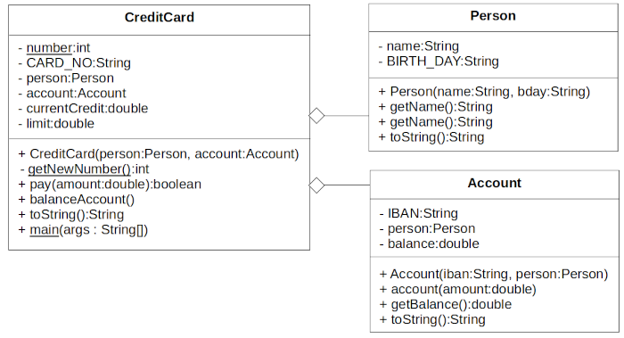

Topic: using objects

## Learning Task: Not a credit card but a fuel card

Read and run the Java CreditCard-class. This class is an aggregation of the Person and the Account classes. The Java code of the classes [Person](Person.java) and [Account](Account.java) is avaiable by clicking on the links.  



Design and implement a FuelCard-class as an imitation of the given CreditCard-class. The FuelCard shall also be related to a person and to an account. But it does not have a limit and any payments are directly performed with help of the account.

``` java
package org.htwd.pool.o3;

public class CreditCard {

    private static int number = 0;

    private final String CARD_NO;
    private Person person;
    private Account account;
    private double currentCredit;
    private double limit;

    public CreditCard(Person person, Account account) {
        this.person = person;
        this.account = account;
        this.CARD_NO = "DC" + CreditCard.getNewNumber();
        this.limit = 2000.0;
        this.currentCredit = 0.0;
    }

    private static int getNewNumber() {
        CreditCard.number++;
        return CreditCard.number;
    }

    public boolean pay(double amount) {
        if ((amount+this.currentCredit) > this.limit)
            return false;
        this.currentCredit += amount;
        return true;
    }

    public void balanceAccount() {
        this.account.account(-1.0*this.currentCredit);
        this.currentCredit = 0.0;
    }

    public String toString() {
        StringBuilder sb = new StringBuilder(this.CARD_NO);
        sb.append(" : Limit EUR:");
        sb.append(this.limit);
        sb.append(" : Credit EUR:");
        sb.append(this.currentCredit);
        sb.append(" : Person:");
        sb.append(this.person);
        sb.append(" : Account:");
        sb.append(this.account);
        return sb.toString();
    }

    public static void main(String[] args) {
        Person bob = new Person("Bob", "27/12/2002");
        Account acc_bob = new Account("DE123454322134", bob);
        CreditCard card = new CreditCard(bob, acc_bob);
        card.pay(20.00);
        System.out.println(card);
        card.balanceAccount();
        System.out.println(card);
    }
}
``` 

---------------------------------------

### Solution

The UML-class-diagram to show the design of the FuelCard-class:


The related implementation of the Java FuelCard-class:

``` java
package org.htwd.pool.o3; 

public class FuelCard {
    private static int number = 0;

    private final String CARD_NO;
    private Person person;
    private Account account;

    public FuelCard(Person person, Account account) {
        this.person = person;
        this.account = account;
        this.CARD_NO = "DC" + FuelCard.getNewNumber();
    }

    private static int getNewNumber() {
        FuelCard.number++;
        return FuelCard.number;
    }

    public boolean pay(double amount) {
        if (amount <= 0.0)
            return false;
        this.account.account(-1.0*amount);
        return true;
    }

    public String toString() {
        StringBuilder sb = new StringBuilder(this.CARD_NO);
        sb.append(" : Person:");
        sb.append(this.person);
        sb.append(" : Account:");
        sb.append(this.account);
        return sb.toString();
    }

    public static void main(String[] args) {
        Person bob = new Person("Bob", "27/12/2002");
        Account acc_bob = new Account("DE123454322134", bob);
        FuelCard card = new FuelCard(bob, acc_bob);
        card.pay(20.00);
        System.out.println(card);
    }
}
``` 

| **Learning objective**                           | **Task type**   | **Complexity** |
| ------------------------------------------------ | --------------- | -------------- |
| understand concepts of using objects             | imitation task  | 2 - normal     |  

#### Previous Knowledge

bcm-1: basics of classes, public/private modifieres  
uob-1: basics of creating and using objects  
uml-3: basics of UML class diagrams including class aggregation

#### Learning Activities

1) read the UML class diagram
2) read the code of the Java CreditCard-class
3) design the FuelCard class as an adaptation of the CreditCard-class diagram
4) implement the Java code of the FuelCard class
5) implement a main-method 
6) run the program to test it

#### Supporting information

[Java-OOP-Poster](../JavaPosterOOP_engl.pdf): Box 5

[tutorialspoint.com: Java - Classes and objects](https://www.tutorialspoint.com/java/java_object_classes.htm)  
[tutorialspoint.com: Java - Aggregation](https://www.tutorialspoint.com/java/java_aggregation.htm)  

Loy, M., Niemeyer, P. and Leuck, D. (2023). Learning Java (6th edition). O'Reilly Media, Inc.: 
Chapter 5, pages 151-156 

---------------------------------------
Author: Robert Ringel, Faculty Informatics/Mathematics, HTWD – University of Applied Sciences  
Version: 10/2025            
License: CC BY-SA 4.0
