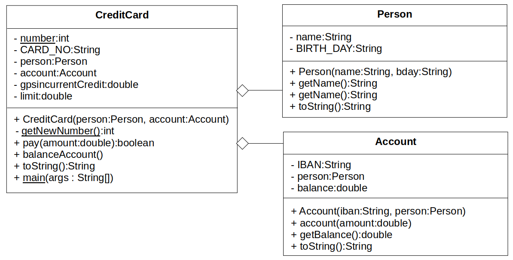

Topic: using objects

## Learning Task: No credit card without account 

Given is the UML class diagram below. It shows the relation between the classes Person, Account and CreditCard. The Java code of the classes [Person](Person.java) and [Account](Account.java) is avaiable by clicking on the links.  



Complete the given Java code of the CreditCard-class that is shown below in a way that it matches the given UML diagram. Implement a main-method to demonstrate the usage of this class.

**The CreditCard class:**
``` java
package org.htwd.pool.o3;

public class CreditCard {

    private static int number = 0;

    private final String CARD_NO;


    private double currentCredit;
    private double limit;

    public CreditCard(...) {
        
        
        this.CARD_NO = "DC" + CreditCard.getNewNumber();
        this.limit = 2000.0;
        this.currentCredit = 0.0;
    }

    private static int getNewNumber() {
        CreditCard.number++;
        return CreditCard.number;
    }

    public boolean pay(double amount) {
        if ((amount+this.currentCredit) > this.limit)
            return false;
        this.currentCredit += amount;
        return true;
    }

    public void balanceAccount() {
        
        this.currentCredit = 0.0;
    }

    public String toString() {
        StringBuilder sb = new StringBuilder(this.CARD_NO);
        sb.append(" : Limit EUR:");
        sb.append(this.limit);
        sb.append(" : Credit EUR:");
        sb.append(this.currentCredit);
        sb.append(" : Person:");
        sb.append(   );
        
        return sb.toString();
    }

}
```

---------------------------------------

### Solution

The solution requires to add the attributes person and accout and the related functionality for these attributes in the constructor, as well as in the balanceAccount and toString methods. Furthermore the main method needs to be implemented.

``` java
package org.htwd.pool.o3; 

public class CreditCard {

    private static int number = 0;

    private final String CARD_NO;
    private Person person;
    private Account account;
    private double currentCredit;
    private double limit;

    public CreditCard(Person person, Account account) {
        this.person = person;
        this.account = account;
        this.CARD_NO = "DC" + CreditCard.getNewNumber();
        this.limit = 2000.0;
        this.currentCredit = 0.0;
    }

    private static int getNewNumber() {
        CreditCard.number++;
        return CreditCard.number;
    }

    public boolean pay(double amount) {
        if ((amount+this.currentCredit) > this.limit)
            return false;
        this.currentCredit += amount;
        return true;
    }

    public void balanceAccount() {
        this.account.account(-1.0*this.currentCredit);
        this.currentCredit = 0.0;
    }

    public String toString() {
        StringBuilder sb = new StringBuilder(this.CARD_NO);
        sb.append(" : Limit EUR:");
        sb.append(this.limit);
        sb.append(" : Credit EUR:");
        sb.append(this.currentCredit);
        sb.append(" : Person:");
        sb.append(this.person);
        sb.append(" : Account:");
        sb.append(this.account);
        return sb.toString();
    }

    public static void main(String[] args) {
        Person bob = new Person("Bob", "27/12/2002");
        Account acc_bob = new Account("DE123454322134", bob);
        CreditCard card = new CreditCard(bob, acc_bob);
        card.pay(20.00);
        System.out.println(card);
        card.balanceAccount();
        System.out.println(card);
    }

}
``` 

| **Learning objective**                           | **Task type**   | **Complexity** |
| ------------------------------------------------ | --------------- | -------------- |
| understand concepts of using objects             | completion task | 2 - normal     |  

#### Previous Knowledge

bcm-1: basics of classes, public/private modifieres  
uob-1: basics of creating and using objects  
uml-2: basics of UML class diagrams including class aggregation

#### Learning Activities

1) read UML class diagram
2) read the given Java code
3) complete the Java code of class CreditCard 
4) implement a main-method in class CreditCard
5) run the program to test it

#### Supporting information

[Java-OOP-Poster](../JavaPosterOOP_engl.pdf): Box 5

[tutorialspoint.com: Java - Classes and objects](https://www.tutorialspoint.com/java/java_object_classes.htm)  
[tutorialspoint.com: Java - Aggregation](https://www.tutorialspoint.com/java/java_aggregation.htm)  

ToDo: Matthes, E. (2019). Python crash course a hands-on, project-based introduction to programming (2nd edition). No Starch Press.:  
Chapter 2, pages 15-32, Chapter 7, pages 114-116  

---------------------------------------
Author: Robert Ringel, Faculty Informatics/Mathematics, HTWD – University of Applied Sciences  
Version: 10/2025            
License: CC BY-SA 4.0
