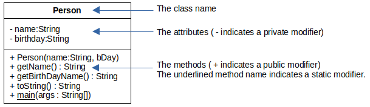

Topic: extension, interface

## Learning Task: The Person-class UML class diagram

The code below represents the Java Person class. Draw the according UML class diagram. Name the important elements and symbols of an UML class diagram.

**The Person class**
``` java
package org.htwd.pool.o3;

public class Person {
    private String name;
    private final String birthDay;

    public Person(String name, String bday) {
        this.name = name;
        this.birthDay = bday;
    }

    public String getName() { return this.name; }
    public String getBirthDay() { return this.birthDay; }

    public String toString() {
        StringBuilder sb = new StringBuilder(this.getName());
        sb.append(" : ");
        sb.append(this.getBirthDay());
        return sb.toString();
    }

    public static void main(String[] args) {
        Person max = new Person("Max", "07/11/2002");
        System.out.println(max);
    }
}
```

---------------------------------------

### Solution

 


| **Learning objective**                           | **Task type**   | **Complexity** |
| ------------------------------------------------ | --------------- | -------------- |
| relate Java source code to an UML class diagram  | conventional task | 1 - low      |

#### Previous Knowledge

bcm-1: basics of classes, public/private/final modifieres  
uml-1: basics of UML class diagrams 

#### Learning Activities

1) read the given Java code
2) draw the UML class diagram
3) name the elements and symbols of an UML class diagram 

#### Supporting information

[Java-OOP-Poster](../JavaPosterOOP_engl.pdf): Box 1

[tutorialspoint.com: UML - Basic Notations: Class Notation](https://www.tutorialspoint.com/uml/uml_basic_notations.htm)  
[tutorialspoint.com: UML - Class Diagram](https://www.tutorialspoint.com/uml/uml_class_diagram.htm)

ToDo: Matthes, E. (2019). Python crash course a hands-on, project-based introduction to programming (2nd edition). No Starch Press.:  
Chapter 2, pages 15-32, Chapter 7, pages 114-116  


---------------------------------------
Author: Robert Ringel, Faculty Informatics/Mathematics, HTWD – University of Applied Sciences  
Version: 10/2025            
License: CC BY-SA 4.0
