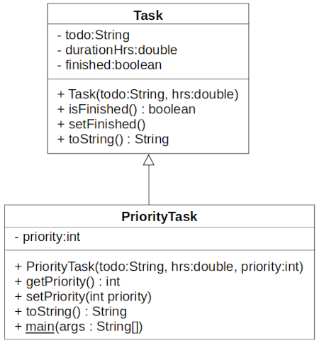

Topic: extension, interface

## Learning Task: Tasks need priorities - UML class diagram

Given are the below Task class and its extension as a PriorityTask class. Read the code to obtain an understanding.  
Draw the according UML class diagram. 

**The Task class:**

``` java
package org.htwd.pool.o2;

public class Task {
    private String todo;
    private double durationHrs;
    private boolean finished;

    public Task(String todo, double hrs) {
        this.todo = todo;
        this.durationHrs = hrs;
        this.finished = false;
    }

    public boolean isFinished() {
        return this.finished;
    }

    public void setFinished() {
        this.finished = true;
    }

    public String toString() {
        StringBuilder sb = new StringBuilder(this.todo);
        sb.append(" : ");
        sb.append(this.durationHrs);
        sb.append(" hrs : finished: ");
        sb.append(this.isFinished());
        return sb.toString();
    }
}
```

**The PriorityTask class:**

``` java
package org.htwd.pool.o2;

public class PriorityTask extends Task {
    private int priority;

    public PriorityTask(String todo, double hrs, int priority) {
        super(todo, hrs);
        this.setPriority(priority);
    }

    public int getPriority() {
        return this.priority;
    }

    public void setPriority(int priority) {
        this.priority = priority;
    }

    public String toString() {
        StringBuilder sb = new StringBuilder("PriorityTask: ");
        sb.append(super.toString());
        sb.append(" : Prio: ");
        sb.append(this.getPriority());
        return sb.toString();
    }

    public static void main(String[] args) {
        PriorityTask p1 = new PriorityTask("Prepare for exam", 10.0, 1);
        PriorityTask p2 = new PriorityTask("Watch TV-News", 2.0, 7);
        System.out.println (p1);
        System.out.println (p2);
    }
}
```

---------------------------------------

### Solution

 

| **Learning objective**                           | **Task type**   | **Complexity** |
| ------------------------------------------------ | --------------- | -------------- |
| relate Java source code to an UML class diagram  | conventional task | 1 - low      |

#### Previous Knowledge

bcm-1: basics of classes, public/private/final modifieres  
uml-2: basics of UML class diagrams including class extension

#### Learning Activities

1) read the given Java code
2) draw the UML class diagram

#### Supporting information

[Java-OOP-Poster](../JavaPosterOOP_engl.pdf): Box 1-3

[tutorialspoint.com: UML - Basic Notations: Class Notation](https://www.tutorialspoint.com/uml/uml_basic_notations.htm)  
[tutorialspoint.com: UML - Class Diagram](https://www.tutorialspoint.com/uml/uml_class_diagram.htm) 

ToDo: Matthes, E. (2019). Python crash course a hands-on, project-based introduction to programming (2nd edition). No Starch Press.:  
Chapter 2, pages 15-32, Chapter 7, pages 114-116  


---------------------------------------
Author: Robert Ringel, Faculty Informatics/Mathematics, HTWD – University of Applied Sciences  
Version: 10/2025            
License: CC BY-SA 4.0