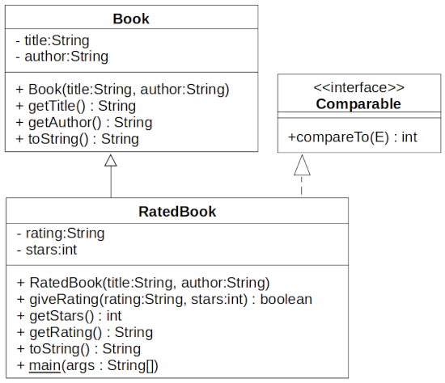

Topic: extension, interface

## Learning Task: Rating favourite books - UML class diagram

Given are the below classes Book and RatedBook. Read the Java code of these classes to obtain an understanding.  
Draw the according UML class diagram. 

**The Book class:**
``` java
package org.htwd.pool.o2;

public class Book {
    private final String title;
    private final String author;

    public Book(String title, String author) {
        this.title = title;
        this.author = author;
    }

    public String getTitle() { return this.title; }
    public String getAuthor() { return this.author; }

    public String toString() {
        StringBuilder sb = new StringBuilder(this.author);
        sb.append(" : ");
        sb.append(this.title);
        return sb.toString();
    }
}
```

**The RatedBook class:**
``` java
package org.htwd.pool.o2;

import java.util.Arrays;

public class RatedBook extends Book implements Comparable<RatedBook> {
    private String rating;
    private int stars;

    public RatedBook(String title, String author) {
        super(title, author);
        this.rating = "";
        this.stars = 0;
    }

    public boolean giveRating(String rating, int stars) {
        if (stars >=0 && stars <=5 ) {
            this.stars = stars;
            this.rating = rating;
            return true;
        }
        return false;
    }

    public int getStars() {
        return this.stars;
    }

    public String getRating() {
        return this.rating;
    }

    public int compareTo(RatedBook other) {
        // descending sequence!
        return other.getStars() - this.getStars();
    }

    public String toString() {
        StringBuilder sb = new StringBuilder(super.toString());
        sb.append(" : Stars:");
        sb.append(this.getStars());
        sb.append("\n");
        sb.append(this.getRating());
        return sb.toString();
    }

    public static void main(String[] args) {
        RatedBook b1 = new RatedBook("Pride and Prejudice", "Jane Austen");
        b1.giveRating("must read!", 4);
        RatedBook b2 = new RatedBook("The Gambler", "Fyodor Dostoevsky");
        b2.giveRating("a real classic book", 3);
        RatedBook b3 = new RatedBook("The Russia House", "John le Carre");
        b3.giveRating("a thrilling spy novel", 5);
        RatedBook[] books = { b1, b2, b3};
        Arrays.sort(books);
        System.out.println("--- Ranked Book List ---");
        for (RatedBook b : books) {
            System.out.println(b);
        }
    }
}
```

---------------------------------------

### Solution



| **Learning objective**                           | **Task type**   | **Complexity** |
| ------------------------------------------------ | --------------- | -------------- |
| relate Java source code to an UML class diagram  | conventional task | 2 - normal   |

#### Previous Knowledge

bcm-1: basics of classes, public/private/final modifieres  
exi-1: basics of class extension  
exi-2: basics of class interfaces  
uml-2: basics of UML class diagrams including extension and interface classes  

#### Learning Activities

1) read the given Java code
2) draw the UML class diagram

#### Supporting information

[Java-OOP-Poster](../JavaPosterOOP_engl.pdf): Boxes 1-4  
[tutorialspoint.com: UML - Basic Notations: Class Notation](https://www.tutorialspoint.com/uml/uml_basic_notations.htm)  
[tutorialspoint.com: UML - Class Diagram](https://www.tutorialspoint.com/uml/uml_class_diagram.htm)

---------------------------------------
Author: Robert Ringel, Faculty Informatics/Mathematics, HTWD – University of Applied Sciences  
Version: 10/2025            
License: CC BY-SA 4.0
