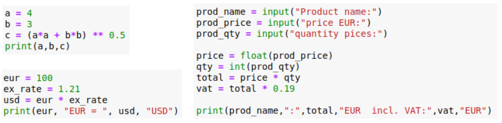

Topic: variables, calculations, printing  

## Learning Task: Examples for data types

Read the 3 given code samples and answer the following questions:  
1) What are the data types and values of the individual variables?  
   Use a table to show the results - variables shall be sorted by data type!  
   Hint: When gets the data type assigned? What causes the data type definition?  
2) How to proceed for entering a number into a Python variable as user input?  

|Variable   | Data Type | Value     |
|-----------|-----------|-----------|
| ...       | ...       | ...       |
| ...       | ...       | ...       |

---------------------------------------

### Solution

| variable   | data type | value  |
|------------|-----------|--------|
| a          | int       | 4      |
| b          | int       | 3      |
| eur        | int       | 100    |
| qty        | int       | 10     |
| c          | float     | 5.0    | 
| ex_rate    | float     | 1.21   | 
| usd        | float     | 121.0  |  
| price      | float     | 21.0   |
| total      | float     | 210.0  |
| vat        | float     | 39.7   |
| prod_name  | string    | "beer" | 
| prod_qty   | string    | "10"   | 
| prod_price | string    | "10"   | 

#### Answer to question 2:

- input returns always a result of data type string  
- before any numeric calculation the data type string needs to be converted to an appropriate numeric data type like int or float

---------------------------------------

| **Learning objective**                         | **Task type**   | **Complexity** |
| ---------------------------------------------- | --------------- | -------------- |
| understanding of basic data types and related values | worked out example | 1 - low |

#### Previous Knowledge

vcp-1: variables, calculations  
vcp-2: data types, type casting functions  

#### Learning Activities

1) read the different Python codes and identify variables and the values assignments
2) determine the data type and value for each variable
3) note the data types and values within the table
4) note the conceptual approach for entering numeric values to variables (answer to question 2)

#### Supporting information

[tutorialspoint.com: Data Types](https://www.tutorialspoint.com/python/python_data_types.htm)
[tutorialspoint.com: Assignments/Calculations](https://www.tutorialspoint.com/python/python_assignment_operators.htm)  
[tutorialspoint.com: User input](https://www.tutorialspoint.com/python/python_user_input.htm)  
Matthes, E. (2019). Python crash course a hands-on, project-based introduction to programming (2nd edition). No Starch Press.:  
Chapter 2, pages 15-32, Chapter 7, pages 114-116  

[www.python-kurs.eu: Ausdrücke und Operatoren](https://www.python-kurs.eu/python3_operatoren.php)

Theis, T.(2017). Einstieg in Python. In Rheinwerk Computing (5., aktualisierte Auflage). Rheinwerk Verlag GmbH.:
Kapitel 2, Seiten 23-27

---------------------------------------

Author: Robert Ringel, Faculty Informatics/Mathematics, HTWD – University of Applied Sciences  
Version: 02/2025  
License: CC BY-SA 4.0
