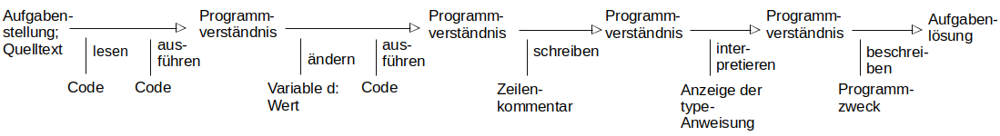

### Aufgabe: Berechnung Kreisumfang

Was leistet das folgende Programm? 
Schreiben Sie Kommentare am Ende der Zeilen 2-4.

Formulieren Sie die Antwort in kurzen Sätzen. 

``` python
print("Berechnung Kreisumfang")
d = 5         # ...
pi = 3.14     # ...
u = pi * d    # ...
print("Durchmesser d:", d)
print("Umfang:", u)
print("----- Datentypen -----")
print("d: ", d, "Datentyp:", type(d))
print("pi:", pi, "Datentyp:", type(pi))
print("u :", u, "Datentyp:", type(u))
```

---------------------------------------
---------------------------------------

##### Lösung

Das Programm berechnet den Kreisumfang für den Durchmesser, der in Variable angegeben ist.
Es zeigt die Werte und die Datentypen aller verwendeten Variablen an. 

``` python
print("Berechnung Kreisumfang")
d = 5         # Kreisdurchmesser
pi = 3.14     # Pi - die Kreiszahl
u = pi * d    # Berechnung des Kreisumfangs in Variable u
...
```

##### Vorwissen

- print-Anweisung
- Variable und Wertezuweisung

##### Lernhandlungen

1) Programmquelltext lesen - ggf. ausführen
2) Verständnis der Zeilen 2-4 herstellen - ggf. Wert für Variable d verändern 
3) Verständnis als Zeilenkommentar aufschreiben
4) Ausgabe der type-Anweisung erkennen und interpretieren
5) 2-3 Antwortsätze gemäß Aufgabenstellung formulieren

##### Lösungsprozess



###### Unterstützende Informationen

Seiten im THEIß-Buch  
[tutorialspoint.com: Variables](https://www.tutorialspoint.com/python/python_variables.htm)

----
[//]: # "Lernziel: Verstehen von Variablen, Berechnung, Ergebnisanzeige"
[//]: # "Thema: Variablen, Berechnung, Anzeige"
[//]: # "Komplexität: 1 - niedrig"
[//]: # "Aufgabentyp: vollständiges Beispiel"

Autor: Robert Ringel, Fakultät Informatik/Mathematik, HTW Dresden  
Version: 08/2024            
Lizenz: CC BY-SA 4.0
