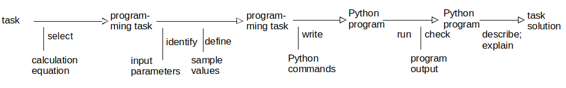

### Learning Task: Basic calculation

Write a Python program for a basic calculation of your own interest! Use the type-function to show the data types of the variables used in your code.

Discuss your program with another student. Explain your programms to each other.

---------------------------------------
---------------------------------------

##### Solution

As an example aconversion program Meters to Yards is shown here.

``` python
print("***** Conversion Meters to Yards *****")
m = 5
f = 1.09361
y = f * m
print("Meters m:", m)
print("Yards  y:", y)
print("----- data types -----")
print("m:", m, "data type:", type(m))
print("f:", f, "data type:", type(f))
print("y:", y, "data type:", type(y))
```

##### Previous Knowledge

- print statement
- variables and assignments to variables
- type function

##### Learning Activities

1) select a basic calculation equation
2) know the input parameters - set sample value for them
3) implement Python code for the calculation including result print-out
4) run the Python code and check the result
5) explain the Python code to another student

##### Problem solving process



###### Supporting information

Seiten im THEIß-Buch  
[tutorialspoint.com: Assignments/Calculations](https://www.tutorialspoint.com/python/python_assignment_operators.htm)

----
[//]: # "Learning objective: Understanding of variables, calculation and result printing"
[//]: # "Topic: variables, calculations, printing"
[//]: # "Complexity: 1 - low"
[//]: # "Task type: Imitation task"

Author: Robert Ringel, Faculty Informatics/Mathematics, HTW Dresden  
Version: 08/2024            
Lizenz: CC BY-SA 4.0
