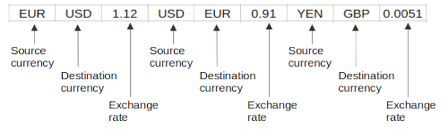

Topic: data structures - list

## Learning Task: Extend currencies list

The following list data structure can be used as a basis for a currency exchange calculation program.  



Implement some lines of Python code to add a new source currency, a new destination currencie and the related exchange rate to the list.  
Finally print the new list of currencies.

``` python
# data of currencies and rates
currencies = ['EUR','USD',1.12,'USD','EUR',0.91,'YEN','GBP',0.0051]

... complete the code here ...

```

---------------------------------------

### Solution

``` python
# data of currencies and rates
currencies = ['EUR','USD',1.12,'USD','EUR',0.91,'YEN','GBP',0.0051]

print('--- Add new currency exchange data ---')

src = input('From what currency:')
dest = input('To what currency:')
rate = float(input('exchange rate:'))

currencies.append(src)          # first add the source currency
currencies.append(dest)         # second add the destination currency
currencies.append(rate)         # third add the exchange rate

print(currencies)
```

| **Learning objective**                         | **Task type**   | **Complexity** |
| ---------------------------------------------- | --------------- | -------------- |
| add data to a list data structure              | completion task | 1 - low        |  

#### Previous Knowledge

vcp-1, vcp-2: print, input, data types  
list-1: list, append  

#### Learning Activities

1) get an understanding of the given list data structure
2) develop an idea to solve the problem 
3) write the code
4) test the code
5) write comments to the code

#### Supporting information

[tutorialspoint.com: lists](https://www.tutorialspoint.com/python/python_lists.htm)  
Matthes, E. (2019). Python crash course a hands-on, project-based introduction to programming (2nd edition). No Starch Press.: Chapter 3, pages 33-48  

[www.python-kurs.eu: Listen](https://www.python-kurs.eu/python3_listen.php)  
Theis, T. (2017). Einstieg in Python. In Rheinwerk Computing (5., aktualisierte Auflage). Rheinwerk Verlag GmbH.: Kapitel 4, Seiten 109-116

---------------------------------------

Author: Robert Ringel, Faculty Informatics/Mathematics, HTWD – University of Applied Sciences  
Version: 02/2025  
License: CC BY-SA 4.0