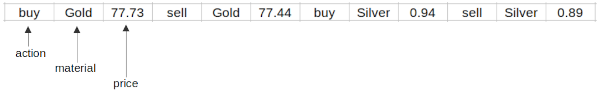

Topic: data structures - list

## Learning Task: Noble metal price calculation

The following program can be used to perform currency exchange calculations.  
Write a similar program to calculate weight depending prices for buying or selling noble metals such as gold or silver.  
Draw a documentation for the list data structure used in your code.

``` python
# data of currencies and rates
currencies = ['EUR','USD',1.12,'USD','EUR',0.91,'YEN','GBP',0.0051]

print('--- Currency exchange calculator ---')

src = input('From what currency:')
dest = input('To what currency:')

i=0     # list index
# loop to loock up the required rate and to perform the calculation
while i<len(currencies):
	if src == currencies[i] and dest == currencies[i+1]:    # currencies found?
		rate = currencies[i+2]                              # yes: get rate
		amount = float(input('Amount:'))                    #      ask for amount
		exchange = amount*rate                              #      calc. exchange
		print('You will get:',exchange,dest)                #      print result
		break                                               #      break loop
	i=i+3                                                   # increment index

if i>=len(currencies):                      # currencies not found
	print('This is not possible.')          #     print message
```

---------------------------------------

### Solution

``` python
# list store store metal prices for buying and selling
material = ['buy','Gold',77.73,'sell','Gold',77.44,'buy','Silver',0.94, 'sell','Silver',0.89]

print('--- Noble metal price calculator ---')

act = input('buy or sell:')
metal = input('sort of metal:')

i=0                       # list index
# look up the material list for the requested action and metal
while i<len(material):
	if act == material[i] and metal == material[i+1]:  # action and metal found?
		price = material[i+2]                          # yes: get the price
		weight = float(input('Weight [g]:'))           #      ask for weight
		amount = price*weight                          #      calculate amount
		print('Total amount:',amount)                  #      print result
		break                                          #      terminate loop
	i=i+3                                              # increment index
if i>=len(material):                         # action and metal not found
	print('This is not possible.')           #    print message
```

**Sketch of the list data structure:**



| **Learning objective**                         | **Task type**   | **Complexity** |
| ---------------------------------------------- | --------------- | -------------- |
| access list items by index                     | imitation task  | 2 - normal     |  

#### Previous Knowledge

vcp-1, vcp-2: print, input, variable , calculation, data type  
branch-2: if using conjuntion  
loop-2: while-break-loop  
list-1: list, index access, len-function  

- list item access by index
- loops and branches
  
#### Learning Activities

1) read the Python code
2) get an understanding of the code
3) design a list data structure for the new program
4) write a similar code for the new program
5) write comments to the new code
6) draw a sketch of the new data structure

#### Supporting information

[tutorialspoint.com: lists](https://www.tutorialspoint.com/python/python_lists.htm)  
Matthes, E. (2019). Python crash course a hands-on, project-based introduction to programming (2nd edition). No Starch Press.: Chapter 3, pages 33-48  

[www.python-kurs.eu: Listen](https://www.python-kurs.eu/python3_listen.php)  
Theis, T. (2017). Einstieg in Python. In Rheinwerk Computing (5., aktualisierte Auflage). Rheinwerk Verlag GmbH.: Kapitel 4, Seiten 109-116

---------------------------------------

Author: Robert Ringel, Faculty Informatics/Mathematics, HTWD – University of Applied Sciences  
Version: 02/2025  
License: CC BY-SA 4.0