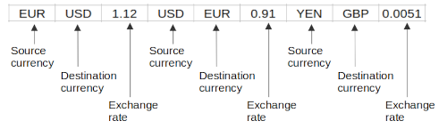

Topic: data structures - list

## Learning Task: Update currency exchange rates

The following list data structure can be used as a basis for a currency exchange calculation program.  



Implement some lines of Python code to update the currency exchange rates for existing currencies.  
Finally print the updated list of currencies.

``` python
# data of currencies and rates
currencies = ['EUR','USD',1.12,'USD','EUR',0.91,'YEN','GBP',0.0051]

... complete the code here ...

```

---------------------------------------

### Solution

``` python
# data of currencies and rates
currencies = ['EUR','USD',1.12,'USD','EUR',0.91,'YEN','GBP',0.0051]

print('--- Change currency exchange rates ---')

src = input('From what currency:')
dest = input('To what currency:')

src_idx = currencies.index(src)                      # get the source curr. index
if src_idx >= 0 and dest == currencies[src_idx+1]:   # check the dest. currency
	print('Current rate:', currencies[src_idx+2])    # print current exch. rate
	rate = float(input('new exchange rate:'))        # ask for new exch. rate
	currencies[src_idx+2] = rate                     # store new exch. rate
	print(currencies)                                # print new currency list
else:
	print(src,'is not a source currency.')
```

#### Previous Knowledge

vcp-1, vcp-2: print, variable, input, data type  
branch-2: if-else  
list-1: list, index access  

#### Learning Activities

1) get an understanding of the given list data structure
2) develop an idea to solve the problem 
3) write the code
4) test the code
5) write comments to the code

#### Supporting information

[tutorialspoint.com: lists](https://www.tutorialspoint.com/python/python_lists.htm)  
Matthes, E. (2019). Python crash course a hands-on, project-based introduction to programming (2nd edition). No Starch Press.: Chapter 3, pages 33-48  

[www.python-kurs.eu: Listen](https://www.python-kurs.eu/python3_listen.php)  
Theis, T. (2017). Einstieg in Python. In Rheinwerk Computing (5., aktualisierte Auflage). Rheinwerk Verlag GmbH.: Kapitel 4, Seiten 109-116

---------------------------------------

Author: Robert Ringel, Faculty Informatics/Mathematics, HTWD – University of Applied Sciences  
Version: 02/2025  
License: CC BY-SA 4.0