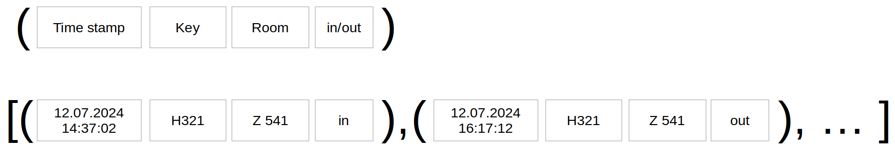

Topic: data structures - tuple

## Learning Task: Door-lock history

The following Python program is used to store the history of door-lockings.

Run the program, read the code and understand it.  
Write comments to the code and draw a sketch to illustrate the design of the related data structure.  
Compare your results with another student.

``` python
# --- door-lock history ---
door_log = []

while True:
	print('---------------')
	key_no = input('Key number:')
	if key_no == '':
		break
	room = input('Room number:')
	in_out = input('In or out:')
	ts = input('Time stamp:')

	record = (ts,key_no,room,in_out)
	door_log.append(record)

print('Door log entries:', len(door_log))

for r in door_log:
	print(r)
```

---------------------------------------

### Solution

``` python
# --- door-lock history ---
door_log = []                             # list for locking-history

while True:                               # loop to process all the locking data
	print('---------------')
	key_no = input('Key number:')         # enter a key number
	if key_no == '':                      # no key?
		break                             # yes: terminate loop
	room = input('Room number:')          # enter room number
	in_out = input('In or out:')          # enter direction
	ts = input('Time stamp:')             # enter time stamp

	record = (ts,key_no,room,in_out)      # create looking record as tuple
	door_log.append(record)               # append record to locking-history

print('Door log entries:', len(door_log)) # print number of lockings

for r in door_log:                        # print the locking history sequence
	print(r)
```

**Sketch of the list data structure:**

  

---------------------------------------

| **Learning objective**                         | **Task type**   | **Complexity** |
| ---------------------------------------------- | --------------- | -------------- |
| compose a tuple, use a list to store tuples    | worked-out example | 3 - high     |  

#### Previous Knowledge

vcp-1, vcp-2: print, input, variable  
branch-1: simple if  
loop-2: while-loop using break  
list-1, list-2: list append, for-iteration  
tuple-1: define a tuple, list of tuples  

#### Learning Activities

1) run, read and understand the given code
2) write comments to the code
3) draw a sketch of the data structure 
4) explain the code to another student

#### Supporting information

[tutorialspoint.com: tuple](https://www.tutorialspoint.com/python/python_tuples.htm)  
Matthes, E. (2019). Python crash course a hands-on, project-based introduction to programming (2nd edition). No Starch Press.: Chapter 4, pages 65-67  

[www.python-kurs.eu: Tupel](https://www.python-kurs.eu/python3_sequentielle_datentypen.php)  
Theis, T. (2017). Einstieg in Python. In Rheinwerk Computing (5., aktualisierte Auflage). Rheinwerk Verlag GmbH.: Kapitel 4, Seiten 116-132

---------------------------------------
Author: Robert Ringel, Faculty Informatics/Mathematics, HTWD – University of Applied Sciences  
Version: 02/2025  
License: CC BY-SA 4.0
