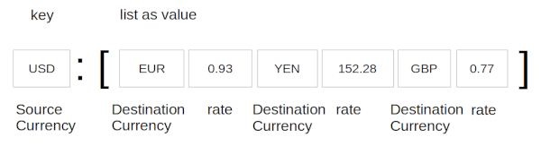

Topic: data structures - dictionary

## Learning Task: Currency exchange table

The following Python program can be used to print currency exchange tables.

Run the program and read the code to understand how it works. Draw a sketch of the dictionary data structure used here.
Write comments into the given Python code.

``` python
# --- Currency exchange table ----

curr_rates = {'USD':['EUR', 0.93, 'YEN', 152.28, 'GBP', 0.77], 
              'EUR':['USD', 1.08, 'GBP', 0.83, 'YEN', 164.51], 
              'GBP':['USD', 1.30, 'YEN', 197.49, 'EUR', 1.20] }

src_currencies = curr_rates.keys()

print('--- source currencies ---')
for c in sorted(src_currencies):
	print(c)

currency = input('Which currency? ')
exchanges = curr_rates.get(currency)
if exchanges == None:
	print('Sorry it is not available')
else:
	i = 0
	print(currency,'rates table')
	while i < len (exchanges):
		print(exchanges[i], exchanges[i+1])
		i = i +2
```

### Solution

``` python
# --- Currency exchange table ----

# currency exchange rates
curr_rates = {'USD':['EUR', 0.93, 'YEN', 152.28, 'GBP', 0.77], 
              'EUR':['USD', 1.08, 'GBP', 0.83, 'YEN', 164.51], 
              'GBP':['USD', 1.30, 'YEN', 197.49, 'EUR', 1.20] }

src_currencies = curr_rates.keys()             # list of source currencies

print('--- source currencies ---')
for c in sorted(src_currencies):               # iterate a sorted list of source currencies
	print(c)                                   # print currency

currency = input('Which currency? ')           # user enters source currency
exchanges = curr_rates.get(currency)           # get list of exchanges for selected currency
if exchanges == None:                          # currency not listed:
	print('Sorry it is not available')         #     print message
else:                                          # currency is listed
	i = 0
	print(currency,'rates table')              # print the exchange rates table
	while i < len (exchanges):                 # loop over all exchanges
		print(exchanges[i], exchanges[i+1])    # print destination currency and rate
		i = i +2                               # increment list index by 2
```

**Sketch of the dictionary data structure:**

 

---------------------------------------

| **Learning objective**                         | **Task type**   | **Complexity** |
| ---------------------------------------------- | --------------- | -------------- |
| access list data stored in a dictionary        | worked-out example | 2 - normal     |  

#### Previous Knowledge

vcp-1, vcp-2: print, input, variable  
branch-2: if-else-branch  
list-1: access items by index  
dict-1, dict-2, dict-3: define dictionary, dictionary stores list, access dictionary data, iterate all items  

#### Learning Activities

1) read and run the code to get an understanding
2) draw a sketch of the  dictionary data structure
3) add comments to the code

#### Supporting information

[tutorialspoint.com: dictionary](https://www.tutorialspoint.com/python/python_dictionary.htm)  
Matthes, E. (2019). Python crash course a hands-on, project-based introduction to programming (2nd edition). No Starch Press.: Chapter 6, pages 92-105  

[www.python-kurs.eu: Dictionary](https://www.python-kurs.eu/python3_dictionaries.php)  
Theis, T. (2017). Einstieg in Python. In Rheinwerk Computing (5., aktualisierte Auflage). Rheinwerk Verlag GmbH.: Kapitel 4, Seiten 120-125

---------------------------------------
Author: Robert Ringel, Faculty Informatics/Mathematics, HTWD – University of Applied Sciences  
Version: 02/2025  
License: CC BY-SA 4.0
