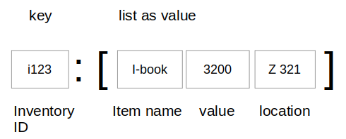

Topic: data structures - dictionary

## Learning Task: Office inventory check

The given Python code implements a grocery store product inventory calculation.  
Read and run the given code in order to get an understanding of the implementation. 

Write a similar program to check office inventory.  
Draw a sketch as documentation for the data structure used in your code.  
Write the program, test it and do not forget to write comments to the code.

``` python
# --- product inventory ----

#             product : [ price, pieces, limit ]
inventory = {'beer' : [0.95, 250, 50], 
	         'wine' : [12.78, 45, 10],
   		     'butter' : [3.21, 324, 50] }

while True:
	print('\n--------------------------')
	for p in inventory.keys():                            # print a the product names by iterating all dictionary keys
		print(p)
	prod = input('Which product - enter name or all: ')
	if prod == 'end':
		break
	if prod == 'all':
		total = 0
		for key, value in inventory.items():              # iterate all dictionary items to get all product names (key) and product data (value)
			price, pcs, limit = value[:]                  # get detailled product information by extracting the data list into items
			print (key,':',pcs, 'pcs:', price,'EUR', pcs*price, 'EUR - limit:',limit)
			total = total + price*pcs
		print('total value:',total,'EUR')
	else:
		if prod in inventory.keys():                      # check if product is listed?
			item = inventory.get(prod)                    # yes: get the product data
			price, pcs, limit =  item[:]                  #      get detailled product information
			print(prod, ':', pcs ,'pcs:', price,'EUR', pcs*price, 'EUR - limit:',limit)  # print requested data
		else:
			print('unknown product')                      # print error message
```

---------------------------------------

### Solution

``` python
# --- office inventory check ----

#      inventory ID : [item name, value, location]
inventory = {'i123' : ['I-Book',3200,'Z 321'], 
	         'b124' : ['Tanenbaum-Modern OS',54,'Z 321'],
   		     'f997' : ['Office chair',324, 'Z 321'] }

while True:
	print('\n--------------------------')
	code = input('Which item - enter code or all: ')
	if code == 'end':                          # end -> end program
		break
	if code == 'all':                          # calculate overall inventory value
		total = 0
		for key, value in inventory.items():   # iterate entire dictionary data
			piece, price, room = value[:]      # extract data items from list
			print (key,':',piece, 'room:', room, price,'EUR')  # print information
			total = total + price              # cumulate value
		print('total value:',total,'EUR')      # print total inventory value
	else:
		if code in inventory.keys():           # check if item is listed
			item = inventory.get(code)         # yes: get item data
			piece, price, room = item[:]       # extract data items from list
			print(piece, 'room:', room, price,'EUR')  # print information
		else:
			print('unknown code')              # item is not listed -> print message
```

**Sketch of the dictionary data structure:**



---------------------------------------

| **Learning objective**                         | **Task type**   | **Complexity** |
| ---------------------------------------------- | --------------- | -------------- |
| access list data stored in a dictionary        | imitation task  | 3 - high       |  

#### Previous Knowledge

vcp-1, vcp-2: print, input, variable  
branch-3: nested if-else  
loop-2: while - break loop  
list-2: list slicing  
dict-1, dict-2, dict-3: define dictionary, dictionary stores list, access dictionary data, iterate dictionary  

#### Learning Activities

1) read the Python code
2) get an understanding of the code
3) design a dictionary data structure for the new program
4) write a similar code for the new program
5) write comments to the new code
6) draw a sketch of the new data structure

#### Supporting information

[tutorialspoint.com: dictionary](https://www.tutorialspoint.com/python/python_dictionary.htm)  
Matthes, E. (2019). Python crash course a hands-on, project-based introduction to programming (2nd edition). No Starch Press.: Chapter 6, pages 92-105  

[www.python-kurs.eu: Dictionary](https://www.python-kurs.eu/python3_dictionaries.php)  
Theis, T. (2017). Einstieg in Python. In Rheinwerk Computing (5., aktualisierte Auflage). Rheinwerk Verlag GmbH.: Kapitel 4, Seiten 120-125

---------------------------------------
Author: Robert Ringel, Faculty Informatics/Mathematics, HTWD – University of Applied Sciences  
Version: 02/2025  
License: CC BY-SA 4.0
