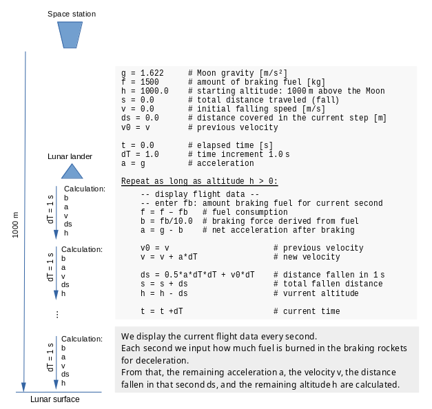

### Theory of landing of the Moon

So far we can calculate the speed with which we will hit the surface after a given time t and the corresponding fall distance s.
However, the landing does not work that way. For the landing we assume that we detach from the space station 1 000 m above the Moon’s surface and then fall down to the Moon – without a parachute, because the Moon has no atmosphere to provide braking.
We have 1 500 kg of rocket fuel on board. This allows us to decide every second how strongly we want to slow the descent using braking rockets. For each second we must compute:

- the fall distance  
- the braking force  
- the fall velocity  

To do this we use the following program concept:

---------------------------------------
Author: Robert Ringel, Faculty Informatics/Mathematics, HTWD – University of Applied Sciences  
Version: 10/2026  
License: CC BY-SA 4.0
