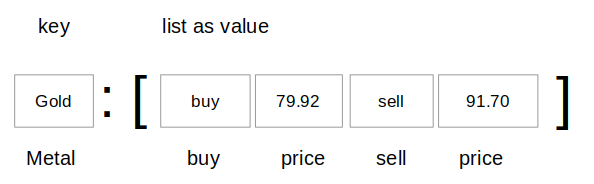

### Learning Task: Noble metal trading

The following program can be used to print currency exchange tables.  
Read and run the given code in order to get an understanding of the implementation. 

Write a similar program to print price tables for buying and selling noble metals.  
Draw a sketch as documentation for the data structure used in your code.  
Write the program, test it and do not forget to write comments to the code.

``` python
# --- Currency exchange table ----

# currency exchange rates
curr_rates = {'USD':['EUR', 0.93, 'YEN', 152.28, 'GBP', 0.77], 
              'EUR':['USD', 1.08, 'GBP', 0.83, 'YEN', 164.51], 
              'GBP':['USD', 1.30, 'YEN', 197.49, 'EUR', 1.20] }

src_currencies = curr_rates.keys()             # list of source currencies

print('--- source currencies ---')
for c in sorted(src_currencies):               # iterate a sorted list of source currencies
	print(c)                                   # print currency

currency = input('Which currency? ')           # user enters source currency
exchanges = curr_rates.get(currency)           # get list of exchanges for selected currency
if exchanges == None:                          # currency not listed:
	print('Sorry it is not available')         #     print message
else:                                          # currency is listed
	i = 0
	print(currency,'rates table')              # print the exchange rates table
	while i < len (exchanges):                 # loop over all exchanges
		print(exchanges[i], exchanges[i+1])    # print destination currency and rate
		i = i +2                               # increment list index by 2
```

---------------------------------------
---------------------------------------

##### Solution

``` python
# --- Noble metal prices ----

# dictionary of metal prices for buying and selling 
metal_prices = {'Gold':['buy', 79.92, 'sell', 91.70], 
                'Silver':['buy', 0.99, 'sell', 3.35], 
                'Platinum':['buy',30.29,'sell',45.98] }

metals = metal_prices.keys()                 # the different metal names

print('--- available metals ---')            # print metal names sorted alphabetically
for m in sorted(metals):
	print(m)

metal = input('Which metal? ')               # user enters a metal name
prices = metal_prices.get(metal)             # access prices from dictionary
if prices == None:                           # not available?
	print('Sorry it is not available')       #     print message
else:
	i = 0                                    # print metal prices for buying and selling
	print(metal,'rate table')
	while i < len (prices):                  # use an index to get data out of the list of prices
		print(prices[i], prices[i+1])        # print price data
		i = i +2                             # increment index

```

**Sketch of the dictionary data structure:**



##### Previous Knowledge

- list item access by index
- loops and branches
- basics of dictionaries
  
##### Learning Activities

1) read the Python code
2) get an understanding of the code
3) design a dictionary data structure for the new program
4) write a similar code for the new program
5) write comments to the new code
6) draw a sketch of the new data structure


##### Supporting information

[tutorialspoint.com: dictionary](https://www.tutorialspoint.com/python/python_dictionary.htm)  
Matthes, E. (2019). Python crash course a hands-on, project-based introduction to programming (2nd edition). No Starch Press.:  
Chapter 6, pages 92-105  

[www.python-kurs.eu: Dictionary](https://www.python-kurs.eu/python3_dictionaries.php)  
Theis, T. (2017). Einstieg in Python. In Rheinwerk Computing (5., aktualisierte Auflage). Rheinwerk Verlag GmbH.:   
Kapitel 4, Seiten 120-125

---------------------------------------
---------------------------------------
#### Meta-Information
*Topic:*  Dictionary data structures 

*Learning objective:*  
- access list data stored in a dictionary

[//]: # "learning objective: 3-dictionary"
[//]: # "previous knowledge: 3-dictionary 1-list 2-loop 1-branch"

*Complexity:*  2-normal 

*Task type:*  imitation task 

----
Author: Robert Ringel, Faculty Informatics/Mathematics, HTWD – University of Applied Sciences  
Version: 10/2024            
License: CC BY-SA 4.0