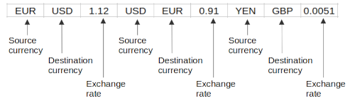

### Learning Task: Existing currencies check

The following list data structure can be used as a basis for a currency exchange calculation program.  



Implement some lines of Python code to check whether the requested source and destination currencies are stored in the list. In case they are part of the list, then print the related exchange rate.

``` python
# data of currencies and rates
currencies = ['EUR','USD',1.12,'USD','EUR',0.91,'YEN','GBP',0.0051]

src = input('Source currency:')
dest = input('Destination currency:')

... complete the code here ...

```

---------------------------------------
---------------------------------------

##### Solution

``` python
# data of currencies and rates
currencies = ['EUR','USD',1.12,'USD','EUR',0.91,'YEN','GBP',0.0051]

src = input('From what currency:')
dest = input('To what currency:')

src_idx = currencies.index(src)                      # look-up the src. curr. index
if src_idx >= 0 and dest == currencies[src_idx+1]:   # check dest. curr. index
	print('related rate:', currencies[src_idx+2])    # print exchange rate
else:
	print(src,'is not a source currency.')
```

**Help:**  
Use the list index-operation to look-up the source currency index:
https://www.tutorialspoint.com/python/list_index.htm

##### Previous Knowledge

- list item access by index
- list index operation
- branches
  
##### Learning Activities

1) get an understanding of the given list data structure
2) develop an idea to solve the problem using the list-index-operation
3) write the code
4) test the code
5) write comments to the code

###### Supporting information

[tutorialspoint.com: lists](https://www.tutorialspoint.com/python/python_lists.htm)  
Matthes, E. (2019). Python crash course a hands-on, project-based introduction to programming (2nd edition). No Starch Press.:  
Chapter 3, pages 33-48  

[www.python-kurs.eu: Listen](https://www.python-kurs.eu/python3_listen.php)
Theis, T. G. P. (2017). Einstieg in Python. In Rheinwerk Computing (5., aktualisierte Auflage). Rheinwerk Verlag GmbH.:   
Kapitel 4, Seiten 109-116

----
[//]: # "Learning objective: access list items by index"
[//]: # "Topic: List data structures"
[//]: # "Complexity: 2 - normal"
[//]: # "Task type: completion task"

Author: Robert Ringel, Faculty Informatics/Mathematics, HTWD – University of Applied Sciences  
Version: 10/2024            
License: CC BY-SA 4.0
