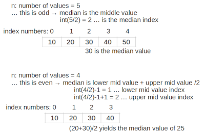

### Learning Task: Median water level

The following program can be used to process water level measurements using a list data structure.

Get an understanding of the program and implement the calculation of the median water level value.  
Draw a sketch including relevant variables to illustrate your solution idea before you start coding!

Test your program and write comments to it.

Help: Explanation of the median calculation: https://www.mathsisfun.com/median.html

``` python
# --- process water level measurements ---

water_level = []                            # the list variable to store the values
while True:                                 # loop to enter data
	val = int(input('Water level [cm]:'))
	if val >= 0:                            # level >= 0 cm?
		water_level.append(val)             # yes: store the value at end of list
	else:
		break                               # no: ... invalid value, break loop

avg = sum(water_level)/len(water_level)     # calculate average water level

# calculate standard deviation
sum2 = 0.0
for v in water_level:
	sum2 = sum2 + (v-avg)**2
std_dev = (sum2/len(water_level))**0.5      

# calculate the median


# show data and basic statistics
print('All measured water level values in centimeters:')
print(water_level)
print('min. value:',min(water_level))
print('max. value:',max(water_level))
print('avg. value:',avg)
print('std. deviation:',std_dev)
```

---------------------------------------
---------------------------------------

##### Solution



``` python
# --- process water level measurements ---

water_level = []                            # the list variable to store the values
while True:                                 # loop to enter data
	val = int(input('Water level [cm]:'))
	if val >= 0:                            # level >= 0 cm?
		water_level.append(val)             # yes: store the value at end of list
	else:
		break                               # no: ... invalid value, break loop

avg = sum(water_level)/len(water_level)     # calculate average water level

# calculate standard deviation
sum2 = 0.0
for v in water_level:
	sum2 = sum2 + (v-avg)**2
std_dev = (sum2/len(water_level))**0.5      

# calculate the median
srt_data = sorted(water_level)              # list of sorted data
n = len(water_level)                        # number of values
if n%2 == 1:                                # odd number of values?
	med_idx = int(n/2)                      # yes: median is exact in the middle
	med_val = srt_data[med_idx]
else:                                       # even number of values
	m = int(n/2)-1                          # lower median index
	med_val = (srt_data[m]+srt_data[m+1])/2 # calc. the medidan

# show data and basic statistics
print('All measured water level values in centimeters:')
print(water_level)
print('min. value:',min(water_level))
print('max. value:',max(water_level))
print('avg. value:',avg)
print('std. deviation:',std_dev)
print('median value:',med_val)
```


##### Previous Knowledge

- basic list operations including sort
- index to access list items 
- modulo operator (%)
  
##### Learning Activities

1) read the Python code
2) develop and idea for the problem
3) draw a sketch including relevant variables
3) write Python code
4) test Python code
5) comment the code


###### Supporting information

[tutorialspoint.com: lists](https://www.tutorialspoint.com/python/python_lists.htm)  
Matthes, E. (2019). Python crash course a hands-on, project-based introduction to programming (2nd edition). No Starch Press.:  
Chapter 3, pages 33-48  

[www.python-kurs.eu: Listen](https://www.python-kurs.eu/python3_listen.php)
Theis, T. G. P. (2017). Einstieg in Python. In Rheinwerk Computing (5., aktualisierte Auflage). Rheinwerk Verlag GmbH.:   
Kapitel 4, Seiten 109-116

----
[//]: # "Learning objective: list index to access list items"
[//]: # "Topic: List data structures"
[//]: # "Complexity: 2 - normal"
[//]: # "Task type: conventional task"

Author: Robert Ringel, Faculty Informatics/Mathematics, HTWD – University of Applied Sciences  
Version: 09/2024            
License: CC BY-SA 4.0
