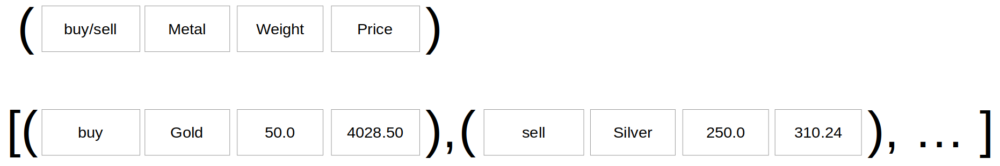

### Learning Task: Noble metal dealing analytics

The following program can be used to calculate the currency exchange balance out of the log of currency exchanges.  
Read and run the given code in order to get an understanding of the implementation. 

Write a similar program to analize a noble metal deal transcation log.  
Draw a documentation for the data structure used in your code.  
Write the program, test it and do not forget to write comments to the code.

``` python
# list of performed currency exchanges - a tupel stores: (fromCurrency, toCurreny, fromAmount, toAmount)
exch = [('EUR','USD',450.00,488.62),('YEN','GBP',23000.00,117.87),('EUR','GBP',1200.00,999.30),('USD','EUR',342.00,315.01)]

currency = input('Which currency:')        # currency for balance to be calculated
sum_rec = 0.0                              # sum of received money
sum_spent = 0.0                            # sum of spent money

for r in exch:                             # iterate the entiere exchange log list
	src = r[0]                             # source currency
	dest = r[1]                            # destination currency
	if src == currency:                    # sum up for currency as source currency?
		sum_rec = sum_rec + r[2]           # yes: sum up received money
	if dest == currency:                   # sum up for currency as destination currency?
		sum_spent = sum_spent + r[3]       # yes: sum up spent money

# show balances
print('received:',sum_rec,'currency')
print('spent   :',sum_spent,'currency')
print('total   :',sum_rec-sum_spent,'currency')
```

---------------------------------------
---------------------------------------

##### Solution

``` python
# --- noble metal dealing balance ---

# the log for metal deal transactions - a tupel stores: (buy/sell, metal, weight_g, money_EUR)
log = [('buy','Gold',50.00,4028.50),('sell','Silver',250.00,310.24),('sell','Gold',80.00,7280,8),('buy','Gold',42.00,3383.94)]

sel_metal = input('Which metal:')

sum_rec_metal = 0.0                                 # initial sum of received metal [g]
sum_spent_metal = 0.0                               # initial sum of spent metal [g]

sum_rec_money = 0.0                                 # initial sum of received money [EUR]
sum_spent_money = 0.0                               # initial sum of spent money [EUR]

for r in log:                                       # iterate the metal transaction log
	act = r[0]                                      # the activity
	metal = r[1]                                    # the metal
	if sel_metal == metal and act == 'buy':         # buy the desired metal?
		sum_rec_metal = sum_rec_metal + r[2]        # yes: sum up the received metal
		sum_spent_money = sum_spent_money + r[3]    #      sum up the spent money
	if sel_metal == metal and act == 'sell':        # sell the desired metal?
		sum_spent_metal = sum_spent_metal + r[2]    # yes: sum up the spent metal
		sum_rec_money = sum_rec_money + r[3]        #      sum up the received money

# print metal balance
print('received:',sum_rec_metal, 'g', sel_metal)
print('spent   :',sum_spent_metal, 'g', sel_metal)
print('total   :',sum_rec_metal-sum_spent_metal,'g', sel_metal)
print() 
# print money balance
print('received:',sum_rec_money, 'EUR')
print('spent   :',sum_spent_money, 'EUR')
print('total   :',sum_rec_money-sum_spent_money,'EUR')
```

**Sketch of the list data structure:**



##### Previous Knowledge

- tuple item access by index
- loops and branches
- iterate a list
  
##### Learning Activities

1) read the Python code
2) get an understanding of the code
3) design a list data structure for the new program
4) write a similar code for the new program
5) write comments to the new code
6) draw a sketch of the new data structure


###### Supporting information

[tutorialspoint.com: tuple](https://www.tutorialspoint.com/python/python_tuples.htm)  
Matthes, E. (2019). Python crash course a hands-on, project-based introduction to programming (2nd edition). No Starch Press.:  
Chapter 4, pages 65-67  

[www.python-kurs.eu: Tupel](https://www.python-kurs.eu/python3_sequentielle_datentypen.php)  
Theis, T. G. P. (2017). Einstieg in Python. In Rheinwerk Computing (5., aktualisierte Auflage). Rheinwerk Verlag GmbH.:   
Kapitel 4, Seiten 116-132

---------------------------------------
---------------------------------------
#### Meta-Information
*Topic:*  Tuple data structures 

*Learning objective:*  
- get data out of a tuple using the index

[//]: # "learning objective: 1-tuple"
[//]: # "previous knowledge: 2-branch 2-list"

*Complexity:*  2-normal 

*Task type:*  imitation task 

----
Author: Robert Ringel, Faculty Informatics/Mathematics, HTWD – University of Applied Sciences  
Version: 10/2024            
License: CC BY-SA 4.0
