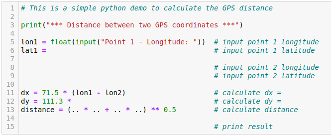

### Learning Task: Distance between GPS co-ordniates

Implement a program to calculate the distance between two GPS points! It is assumed that the points distance is relatively close (some kilometers) and that they are in the same earth quadrant.

Note: Entering the coordinate data shall be done using the input-function. The calculation is based on the theorem of Pythagoras. There is no square-root-function available. Use the related power-function instead.

The following web page explains the concept in the section "Einfachste Entfernungsberechnung": https://www.kompf.de/gps/distcalc.html

Demonstrate your program to an other student and explain it!

---------------------------------------
---------------------------------------

##### Solution

``` python
# This is a simple python demo to calculate the GPS distance 

print("*** Distance between two GPS coordinates ***")

lon1 = float(input("Point 1 - Longitude: "))
lat1 = float(input("Point 1 - Latitude : "))

lon2 = float(input("Point 2 - Longitude: "))
lat2 = float(input("Point 2 - Latitude:  "))

dx = 71.5 * (lon1 - lon2)
dy = 111.3 * (lat1 - lat2)
distance = (dx * dx + dy * dy) ** 0.5

print("Distance [km]: ",distance)
```

*Initial help:*  


*More help:*  



##### Previous Knowledge

- variables, data types, calculations
- type casting functions
 
##### Learning Activities

1) read the task and discuss the problem 
2) note the equation of the theorem of Pythagoras
3) adopt the theorem of Pythagoras to the earth grid of your region
4) write appropriate Python code
5) test the Python program using known co-ordinates and distances
6) speek about your code with another student - add comments to the code


###### Supporting information

Seiten im THEIß-Buch  
[tutorialspoint.com: Variables](https://www.tutorialspoint.com/python/python_data_types.htm)

----
[//]: # "Learning objective: Problem solving using basic calculation"
[//]: # "Topic: variables, calculations, printing"
[//]: # "Complexity: 2 - normal"
[//]: # "Task type: conventional task"

Author: Robert Ringel, Faculty Informatics/Mathematics, HTWD – University of Applied Sciences  
Version: 08/2024            
Lizenz: CC BY-SA 4.0
