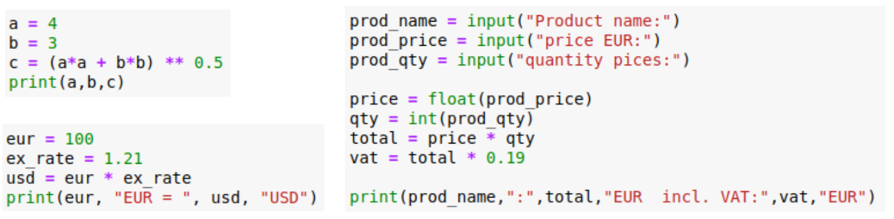

### Learning Task: Examples for data types

Read the given code samples and answer the following questions:  
1) What are the data types and values of the individual variables?  
   Use a table to show the results - variables shall be sorted by data type!  
   Hint: When gets the data type assigned? What causes the data type definition?  
2) How to proceed for entering a number into a Python variable as user input?  

|Variable   | Data Type | Value     |
|-----------|-----------|-----------|
| ...       | ...       | ...       |
| ...       | ...       | ...       |

---------------------------------------
---------------------------------------

##### Solution

| variable   | data type | value  |
|------------|-----------|--------|
| a          | int       | 4      |
| b          | int       | 3      |
| eur        | int       | 100    |
| qty        | int       | 10     |
| c          | float     | 5.0    | 
| ex_rate    | float     | 1.21   | 
| usd        | float     | 121.0  |  
| price      | float     | 21.0   |
| total      | float     | 210.0  |
| vat        | float     | 39.7   |
| prod_name  | string    | "beer" | 
| prod_qty   | string    | "10"   | 
| prod_price | string    | "10"   | 

###### Answer to question 2:
- input returns always a result of data type string
- before any numeric calculation the data type string needs to be converted to an appropriate numeric data type like int or float

##### Previous Knowledge

- variables, data types, calculations
- type casting functions
 
##### Learning Activities

1) read the different Python codes and identify variables and the values assignments
2) determine the data type and value for each variable
3) note the data types and values within the table

4) note the conceptual approach for entering numeric values to variables (answer to question 2)

###### Supporting information

Seiten im THEIß-Buch  
[tutorialspoint.com: Variables](https://www.tutorialspoint.com/python/python_data_types.htm)

----
[//]: # "Learning objective: Understanding of basic data types and related values"
[//]: # "Topic: variables, calculations, printing"
[//]: # "Complexity: 1 - low"
[//]: # "Task type: worked out example"

Author: Robert Ringel, Faculty Informatics/Mathematics, HTWD – University of Applied Sciences  
Version: 08/2024            
Lizenz: CC BY-SA 4.0
