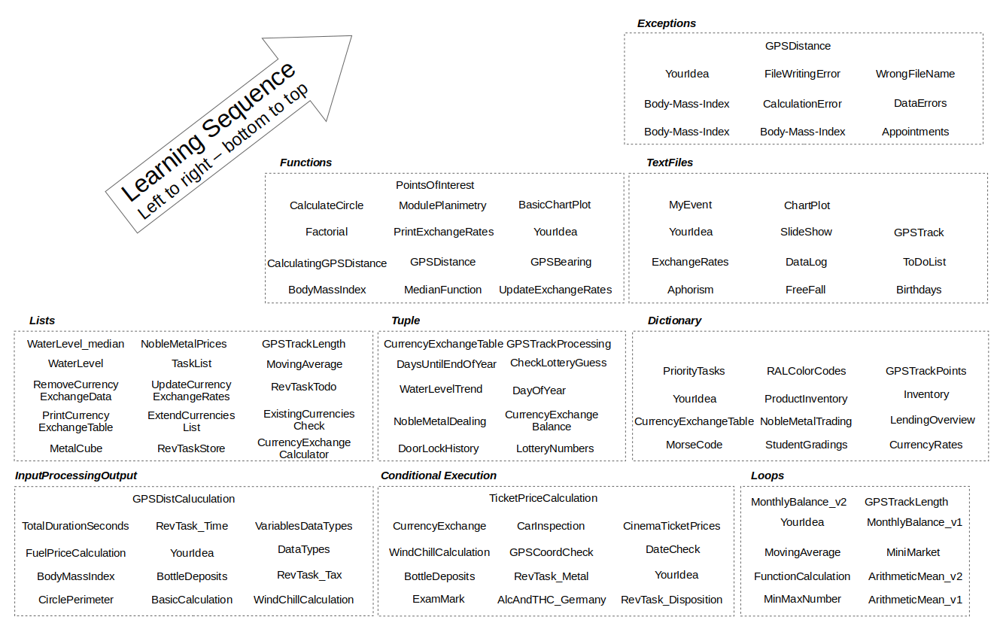

This task pool provides a set of learning tasks for learning Python programming. It contains 109 tasks (February 2025).
The numbering schema of the different task sets is related to their content. Following the sequence of numbers results in a task sequence
to start from very basic topics towards the more and more advanced ones.

The content of the task pool currently covers the following topics:
- Input Processing Output  
- Execution Control (Branches, Loops)
- Data Structures (List, Tupel, Dictionary)
- Functions and Modules  
- Processing text files
- Exception handling

This image illustrates the inted learning sequence of the task repository:

Each learning task has some required previous knowledge. It is listed in the task description based on the classification schema described in this file: 
[ContentTagDefinitions.md](ContentTagDefinitions.md) 

Feel free to design more learning tasks inpired by the ones shown here. Do not hesitate to contact me in case of questions or
contribute to this repository by sending my your learning tasks to be added to this collection.

Robert Ringel, HTW Dresden, February 2025  
email: robert.ringel@htw-dresden.de
